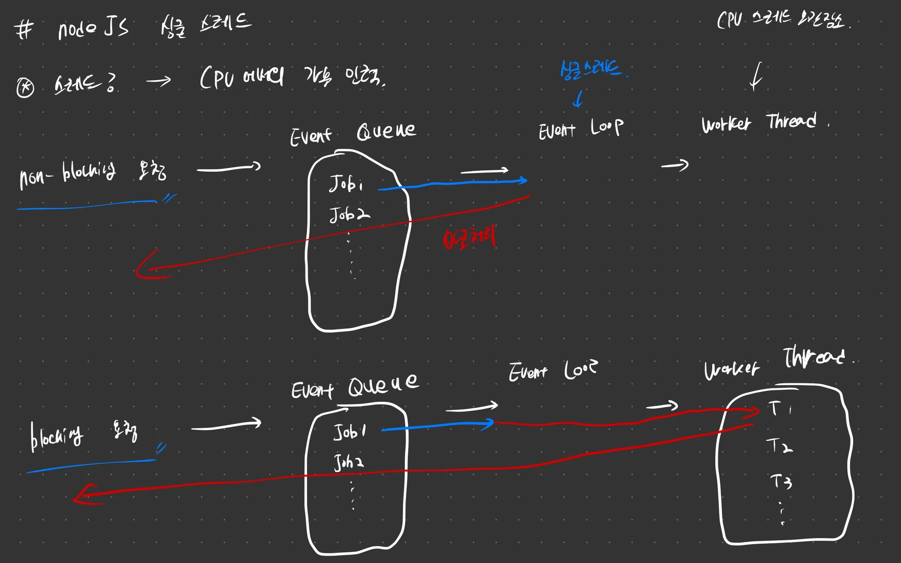

# node 와 nest 개요

## 개요

nestjs 는 node 엔진을 사용하기 때문에 node 에 대한 기본적인 이해가 필요함.

## 본론

### Node 특징

node 의 특징은 크게 3가지로 다음과 같다.

- 오픈소스: 나만의 node 엔진을 만들고 싶으면 git fork 해서 커스텀 하기도 함

- js compiler: javascript 의 컴파일러다.

- 크로스 플랫폼: 타깃 플랫폼에 영향을 받지 않음.

### JIT (Just in time compilation)

이를 이해하기 위해선 먼저 compiled 언어와 interprited 언어의 차이를 이해하면 좋다.

| interprited 언어 | compiled 언어  |
| --- | --- |
| 프로그램을 실행하면서 한줄씩 컴파일 | 코드를 한번에 통으로 기계어로 변환 |
| 비교적 느리다 | 프로그램 실행 속도가 빠름 |
| 변경된 부분만 컴파일 하면 돼서 컴파일 속도가 빠름 | 코드 변경 때마다 통으로 컴파일을 해야함 |
| 따로 인터프리터가 존재해 어느 플랫폼에서든 실행 가능 | 실행되는 플랫폼 (OS) 에서 직접 컴파일 → 종속적 |

이 두가지 언어들의 장점만 뽑아내고 싶어서 JIT 라는 개념이 만들어짐

JIT 순서는 다음과 같다.

1. 실행환경

1. 컴파일

1. 바이트 코드 생성
  1. Turbofan 이라는 tool이 반복되는 바이트 코드를 식별 (이를 optimized 라고 함)
  2. Ignition 에 보냄 (이때 반복되지 않을 거 같은건 deoptimized 함)

1. Ignition Interpriter 로 실행

| byte code | machine code |
| --- | --- |
| Interpriter 를 통한 바이트 코드 | 0101 같은 low level |
| 컴파일 속도 good, 실행 속도 비교적 느림 | 컴파일 속도 비교적 느린데 실행속도가 빠름 |

반복되는 애들은 캐싱 느낌으로 Ignition 컴파일에서 제외하고 반복 안되는 애들만 해서 컴파일 속도도 잡고 실행속도도 잡을 수 있는 JIT 컴파일러를 만들었다.

### Node JS 싱글 스레드

스레드란? 

CPU 에서의 가용 인력이라고 생각하면 편하다

Non-Blocking vs Blocking 요청

Non-Blocking 은 응답 시간이 굉장히 짧게 걸리는 단순한 요청들을 말하고 Blocking 요청은 대량 DB 조회와 같이 처리 시간이 오래 걸릴거 같은 요청을 말한다.

NodeJs 안에 처리 과정은 다음과 같다.

HTTP 요청 → Event Queue → Event Loop (얘가 단일 스레드) → Worker Thread (예비 스레드)

Non-Blocking 과 Blocking 요청 과정이 조금 상이하다.

Non-Blocking 요청시

1. Non-Blocking 요청 

1. Event Queue 적재됨 (Rq1, Rq2, ….)

1. Event Loop 에서 굉장히 빠르게 처리

1. Front 응답

Blocking 요청시

1. Blocking 요청

1. Event Queue 적재됨 (Rq1, Rq2, ….)

1. Event Loop 에서 오래 걸릴거 같음을 인지하여 Worker Thread 로 해당 요청 전송

1. Worker Thread 에서 다른 스레드가 처리 (이때 Event Loop 는 다른 요청들을 처리함, 이게 비동기처리) 

1. 처리 끝나면 Event Loop → Front 로 응답

### nest

nestjs 는 Express 로 설계 됐고, Express 를 이런 프레임워크 형태로 사용하면 

좋은 아키텍처, 테스트 쉽게, 디커플링 쉽게, 관리 편하게 사용할 수 있다고 느껴 만들게 됨.
