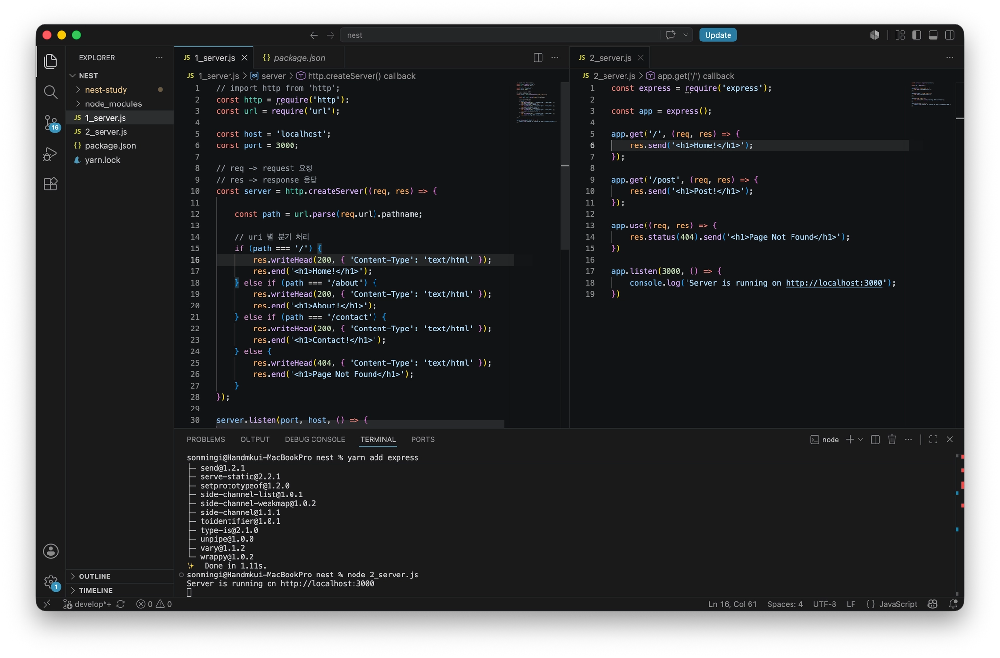
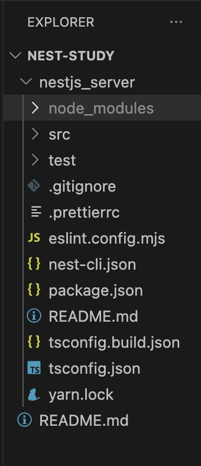

# node Js + Express 기본 서버 구성


## 개요

어떤 프레임워크 든 프레임워크 없이 구현을 해보면 왜 이게 편한건지, 왜 쓰는지를 이해할 수 있다.

node 와 express, nest 로 단순 controller 기능을 구성했을 때 어떤 차이가 있는지 비교

## 본론

### node 로 구성

node 내장 패키지로 http 패키지가 존재한다.

해당 패키지를 import 하여 req, res 구성하고 한다. 만약 다양한 엔드포인트로 접근토록 하려면 다음과 같이 if - else 로 분기처리 하여 path 별 응답 코드를 작성해야 한다.

```javascript
// import http from 'http';
const http = require('http');
const url = require('url');

const host = 'localhost';
const port = 3000;

// req -> request 요청
// res -> response 응답
const server = http.createServer((req, res) => {

    const path = url.parse(req.url).pathname;

    // uri 별 분기 처리
    if (path === '/') {
        res.writeHead(200, { 'Content-Type': 'text/html' });
        res.end('<h1>Home!</h1>');
    } else if (path === '/about') {
        res.writeHead(200, { 'Content-Type': 'text/html' });
        res.end('<h1>About!</h1>');
    } else if (path === '/contact') {
        res.writeHead(200, { 'Content-Type': 'text/html' });
        res.end('<h1>Contact!</h1>');
    } else {
        res.writeHead(404, { 'Content-Type': 'text/html' });
        res.end('<h1>Page Not Found</h1>');
    }
});

server.listen(port, host, () => {
    console.log(`Server is running on http://${host}:${port}`);
});

```

이런식으로 http 패키지를 사용하게 되면 path 분기 처리 로직이 길어지고, 오디오 파일이라던지 param 파싱 등 과 같은 좀 더 섬세한 작업이 어려워진다.

그렇기 때문에 Express 를 사용한다!

### express 로 구성

```javascript
const express = require('express');

const app = express();

app.get('/', (req, res) => {
    res.send('<h1>Home!</h1>');
});

app.get('/post', (req, res) => {
    res.send('<h1>Post!</h1>');
});

app.use((req, res) => {
    res.status(404).send('<h1>Page Not Found</h1>');
})

app.listen(3000, () => {
    console.log('Server is running on http://localhost:3000');
})
```



단순히 코드 라인수만 비교해도 node 로 지저분한 조건 분기처리 한것보다 훨씬 보기 편하다.

물론 이것도 꽤 익숙한 구조이긴 하나, 이를 더 쉽게 사용하기 위해 만든것이 nest 이다.

### nest 로 구성

nest 공식문서에서는 프로젝트를 구성하는데에 nest-cli 를 제공한다.

```javascript
npm i -g @nestjs/cli
nest new {프로젝트 명}
```



다음과 같이 nest 의 최소 구성 파일이 생성된다.

```javascript
import { Controller, Get } from '@nestjs/common';
import { AppService } from './app.service';

@Controller()
export class AppController {
  constructor(private readonly appService: AppService) { }

  @Get()
  home() {
    return 'hello world';
  }

  @Get("/post")
  post() {
    return 'post';
  }
}
```

express 를 사용한 구성보다 좀 더 함수화된 구성을 볼 수 있다.

앞선 node - express 구성 보다 더 깔끔한 것 같다. 작성한 어플리케이션을 실행하려면 다음 명령어로 실행한다.

```javascript
// dev 를 붙여야 변경사항을 감지하여 반영됨
yarn start:dev
```
