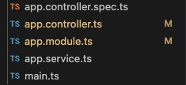
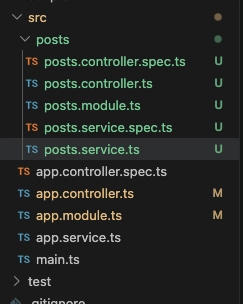

# controller

nest 로 REST API 를 개발할 때 CRUD 컨트롤러를 구성하는 방법을 기재한 내용이다.

## 본론

기본적으로 nest project 를 생성하면 이런식으로 src > 하위에 controller, service, module, spec 파일이 생성된다. 하지만 서비스를 만들 때 보통 도메인별로 모듈화하여 구성하기 때문에 별도의 파일로 쪼개야 한다. 



멀티 모듈을 구성하는 방법으로 nest 에서는 nest-cli 를 권장한다. 다음과 같이 `nest g resource` 명령어를 호출하면 모듈명을 지정하고 모듈을 생성할 수 있다.

```jsx
sonmingi@Handmkui-MacBookPro nest-study % nest g resource
✔ What name would you like to use for this resource (plural, e.g., "users")? posts
✔ What transport layer do you use? REST API
? Would you like to generate CRUD entry points? (Y/n) n
```

posts 모듈이 생성됨을 확인할 수 있다.



### GET

`@Get` 데코레이터로 구성. path 의 값을 가져오고 싶으면 `@Param()` 사용.

기본적으로 string 으로 받아오기 때문에 필요시 타입변환을 해야한다. 여러 Parameter 가 있을 수 있는데 이때 특정하고 싶으면 아규먼트를 지정 (ex. id) 하면 된다.

``` tsx
  /**
   * GET /posts
   * @description 모든 posts를 가져오는 API
   * @returns 모든 posts
   */
  @Get()
  getPosts(){
    return posts;
  }

  /**
   * GET /posts/:id
   * @description 특정 post를 가져오는 API
   * @returns 특정 post
   */
  @Get(':id')
  getPost(@Param('id') id: string){

    // find 메서드는 배열에서 특정 조건을 만족하는 요소를 반환, 만약 조건을 만족하는 요소가 없다면 undefined를 반환
    // undefined 는 boolean false 로 평가됨
    const foundedPost = posts.find((post) => post.id === parseInt(id));

    // 만약 post가 존재하지 않는다면 NotFoundException을 발생
    if(!foundedPost){
      throw new NotFoundException();
  }

  return foundedPost;
  }

```  

### POST

`@Post()` 데코레이터로 구성. 요청시 body 를 포함하려면 `@Body()` 사용

``` tsx
 /**
   * POST /posts
   * @description 새로운 post를 생성하는 API
   * @param author 작성자
   * @param title 제목
   * @param content 내용
   * @returns 새로 생성된 post
   */
  @Post()
  postPosts(
    @Body('author') author: string,
    @Body('title') title: string,
    @Body('content') content: string,
  ){

    const post = { 
      id: posts[posts.length - 1].id + 1,  
      author,
      title,
      content,
      likeCount: 0,
      commentCount: 0
    }

    posts.push(post);

    return post;
  }
```

### PUT

`@Put()` 데코레이터 사용

```tsx
  /**
   * PUT /posts/:id
   * @description 특정 post를 수정하는 API
   * @param id id
   * @param author 작성자 
   * @param title 제목
   * @param content 내용
   * @returns 수정된 post
   */
  @Put(':id')
  putPost(
    @Param('id') id: string,

    // ? 붙이면 null 허용
    @Body('author') author?: string,
    @Body('title') title?: string,
    @Body('content') content?: string
  ){
    const foundedPost = posts.find((post) => post.id === parseInt(id));

    if(!foundedPost){
      throw new NotFoundException();
    }

    if (author){
      foundedPost.author = author;
    }

    if (title){
      foundedPost.title = title;
    }

    if (content){
      foundedPost.content = content;
    }

    // map 순회 하면서 id 가 일치하는 post 만 업데이트
    posts = posts.map((prevPost) => prevPost.id === parseInt(id) ? foundedPost : prevPost);

    return foundedPost;
  }
```

### DELETE

`@Delete()` 데코레이터 사용

```tsx
  /**
   * DELETE /posts/:id
   * @description 특정 post를 삭제하는 API
   * @param id id
   * @returns 삭제된 post
   */
  @Delete(':id')
  deletePost(
    @Param('id') id: string,
  ){
    const foundedPost = posts.find((post) => post.id === parseInt(id));

    if(!foundedPost){
      throw new NotFoundException();
    }

    // filter 순회 하면서 id 가 일치하지 않는 post 만 남김
    posts = posts.filter((post) => post.id !== parseInt(id));
    
    return foundedPost;
  }
```

### 내장 Exception
nest 에서 기본적으로 제공하는 Exception 이 있다. (ex. NotfoundException..)

해당 공식문서에서 필요한 Exception 을 확인하여 사용하면 괜찮을 것 같다. 

https://docs.nestjs.com/exception-filters#built-in-http-exceptions