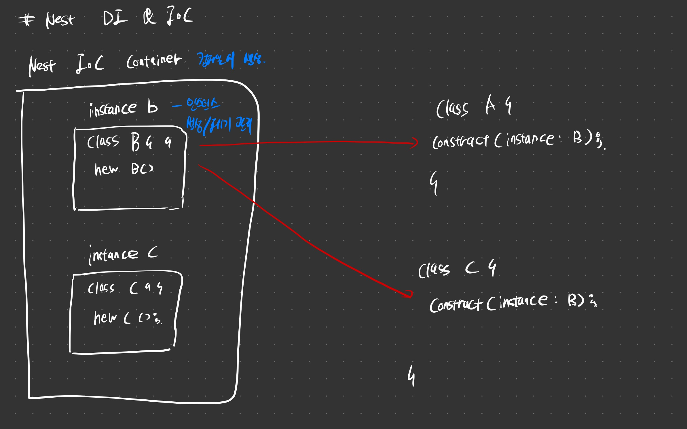

# DI & IoC

nestjs 에서의 DI (의존성 주입), IoC (제어의 역전) 을 다룬 내용이다.

## 본론

### DI & IoC

DI (Dependency Injection) 는 의존성 주입이다.
A 라는 클래스에서 B 의 메서드를 사용하고 싶을 때, 다음과 같이 한다.

``` javascript
class A {
    const b = B();
}

class B {}
```

프레임워크를 사용하게 되면 다음과 같이 바뀐다.

``` tsx 
class A {
    construct(instance: B)
}

class B{}
```

A 인스턴스를 생성할 때 construct() 를 호출하는데, 이때 class B 인스턴스를 주입하게 된다.
이를 A -> B 에 의존하고 있다. 즉, A의 인스턴스 생성 시 B 인스턴스가 주입된다. 라고 표현한다.

IoC (Inverse of Control) 는 제어의 역전이다.
앞서 DI 에서의 예시처럼 인스턴스를 직접 생성하는 것이 아니라 프레임워크로부터 주입받는다.

컴파일과 동시에 NestJS IoC Container 가 생성되고, providers 로 등록된 클래스들을 식별해 컨테이너에 인스턴스를 생성한다. 그리고 특정 클래스에서 필요하면 주입한다. 이것이 제어의 역전이다.



생성한 인스턴스들에 대한 생성/폐기 주기를 이 컨테이너가 하게 되고 개발자는 로직에만 신경쓰면 된다.

### Modules

모듈을 생성하면 *.modules.ts 가 생성되는 걸 볼 수 있다.

```tsx
@Module({
  controllers: [PostsController],  // nest 프레임워크에 직접 등록해야 한다.
  providers: [PostsService],
})
```

여기서 `PostController()`, `PostService()` 가 아닌 클래스를 직접 넣는걸 볼 수 있다. 인스턴스의 생성/폐기를 프레임워크에 위임해야 하기 때문이다. (IoC)

안에 파라미터로 controller 와 providers 를 확인할 수 있다. 

- controller: 해당 모듈의 controller 를 등록
- providers: 꼭 service 가 아니더라도 특정 클래스에 주입이 필요한 클래스들 (ex. TypeORM, DB 설정 등..) 등록

> 단, 해당 클래스에 @Injectable (주입 가능한) 데코레이터를 붙어야 등록 가능

### app.module.ts

기본적으로 생성되는 app.module.ts 에는 imports 필드를 확인할 수 있다. 이는 해당 모듈에서 다른 모듈을 불러올 때 등록하는 필드다.

``` tsx
@Module({
  imports: [PostsModule], // 다른 모듈을 불러올 때
  controllers: [AppController],
  providers: [AppService],
})
export class AppModule {}
```