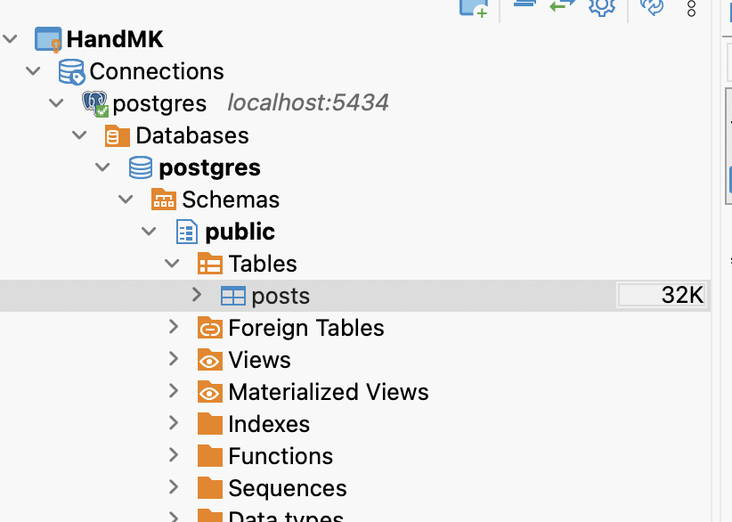

# TypeORM 기본

nestjs 에서의 TypeORM 에 대한 기본을 다룬 내용이다.

# 본론

## typeorm 패키지 설치

`typeorm` 과 postgresql 과 통신하기 위한 `pg` 를 설치한다.

```shell
% yarn add @nestjs/typeorm typeorm pg
```

## 데이터베이스 연결 설정

연결하고자 하는 module.ts 에 imports (해당 모듈에서 다른 모듈 사용 시) 를 정의한다.
이때, `TypeORMModule.forRoot()` 로 정의하고 DB 접속 정보를 입력한다. 파라미터는 아래와 같다.

```tsx
@Module({
  imports: [
    PostsModule,
    TypeOrmModule.forRoot({
      type: "postgres", // 데이터베이스 타입
      host: "127.0.0.1",
      port: 5434,
      username: "postgres",
      password: "postgres",
      database: "postgres", // 데이터베이스까지 생성됨
      entities: [],
      synchronize: true, // 실제 데이터베이스와 싱크를 맞출꺼냐
    }),
  ],
  controllers: [AppController],
  providers: [AppService],
})
export class AppModule {}
```

## Entity 생성

DB 연결 정상을 확인했다면, Table 을 생성한다.

```tsx
import { Column, Entity, PrimaryGeneratedColumn } from "typeorm";

@Entity()
export class Posts {
  @PrimaryGeneratedColumn()
  id: number;

  @Column()
  author: string;

  @Column()
  title: string;

  @Column()
  content: string;

  @Column()
  likeCount: number;

  @Column()
  commentCount: number;
}
```



## Repository 설정

일정한 패턴이 존재한다.

1. orm 사용하고자 하는 module 에 repository import
2. service repository 인스턴스 주입
3. repository 메서드 호출

**1. posts.module.ts import**

```tsx
@Module({
  imports: [
    // repository 설정
    // app.module.ts 와 다르게 forFeature 로 사용
    TypeOrmModule.forFeature([Posts]),
  ],
  controllers: [PostsController],
  providers: [PostsService],
})
export class PostsModule {}
```

**2. posts.service.ts repository 주입**

```tsx
@Injectable()
export class PostsService {

  // repository 주입
  constructor(
    @InjectRepository(Posts)
    private readonly postRepository: Repository<Posts>,
  ) {}
```

**3. repository 메서드 사용**

**READ**

```tsx
  /**
   * GET 모두
   * @abstract 모든 posts를 가져오는 함수
   * @returns 모든 posts
   */
  async getAllPosts() {
    return this.postRepository.find(); // 모든 TypeORM 메서드는 async
  }
```

```tsx
  /**
   * GET 단일
   *
   * id를 기반으로 특정 post를 가져오는 함수
   * @param id 고유 id
   * @returns 특정 post
   */
  async getPostsById(id: number) {
    // 1. findOne() -> DB 소켓에 쿼리 날리고 아직 값이 없는 Promise<Posts> 를 즉시 반환
    // 2. await 가 Promise 에 완료되면 깨워달라고 등록하고 함수 중단
    // 3. 이때 스레드는 다른 요청 처리하러 감.
    // 4. DB 응답 도착
    // 5. 이벤트 큐에서 2번 작업 꺼냄
    // 6. 함수 재개
    const post = await this.postRepository.findOne({
      // id 값이 일치하는 row 필터
      where: {
        id: id,
      },
    });

    if (!post) {
      throw new NotFoundException();
    }

    return post;
  }
```

**CREATE**

```tsx
  /**
   * @abstract 새로운 post를 생성하는 함수
   * @param author 작성자
   * @param title 제목
   * @param content 내용
   * @returns 새로 생성된 post
   */
  async postPosts(author: string, title: string, content: string) {
    // 1) create -> 저장할 객체 생성
    // 2) save -> 객체 저장

    const post = this.postRepository.create({
      // key == value 변수 명이 같으면 하나만 써도 됨.
      author,
      title,
      content,
      likeCount: 0,
      commentCount: 0,
    });

    const newPost = await this.postRepository.save(post);

    return newPost;
  }
```

**UPDATE**

```tsx
  /**
   * @discription 특정 post를 수정 함수
   * @param id 고유 id
   * @param author 작성자
   * @param title 제목
   * @param content 내용
   * @returns 수정된 post
   */
  async putPostById(
    id: number,
    author?: string,
    title?: string,
    content?: string,
  ) {
    // 만약에 데이터가 존재한다면 (같은 id 값이 있다면) 그냥 save 해도 업데이트

    const foundedPost = await this.postRepository.findOne({
      where: {
        id,
      },
    });

    if (!foundedPost) {
      throw new NotFoundException();
    }

    if (author) {
      foundedPost.author = author;
    }

    if (title) {
      foundedPost.title = title;
    }

    if (content) {
      foundedPost.content = content;
    }

    const updatedPost = await this.postRepository.save(foundedPost);

    return updatedPost;
  }
```

**DELETE**

```tsx
  /**
   * @discription 특정 post를 삭제하는 함수
   * @param id 고유 id
   * @returns 삭제된 post
   */
  async deletePostById(id: number) {
    const foundedPost = await this.postRepository.findOne({
      where: {
        id,
      },
    });

    if (!foundedPost) {
      throw new NotFoundException();
    }

    // filter 순회 하면서 id 가 일치하지 않는 post 만 남김
    await this.postRepository.delete(id);

    return id;
  }
```

## async & await

`Node` 는 `Java` 와 다르게 싱글 스레드이다. 때문에 DB 응답을 기다리며 멈추게 되면 서버 전체가 멈춘다.

그래서 Node 의 모든 I/O 는 "결과를 나중에 준다" 라고 약속만 돌려주고 즉시 리턴한다. 그 약속이 `Promise` 이다.

TypeORM 에서의 `repository.findOne()` 도 엔티티가 아니라 Promise<T> 를 반환한다.

`async` 키워드를 메서드에 붙이면 '이 함수는 Promise 를 반환한다.' 라고 생각하면 된다.

```tsx
async getNumber(){
  return 1; // 실제론 Promise<number> 이다.
}
```

`await`는 Entity 객체의 필드를 열기 전까지 일시정지 라는 것이다.

```tsx
const user = await this.repository.findOne({where: id: id,}); // 여기서 제어권이 스레드 ->
console.log(user.name)
```
