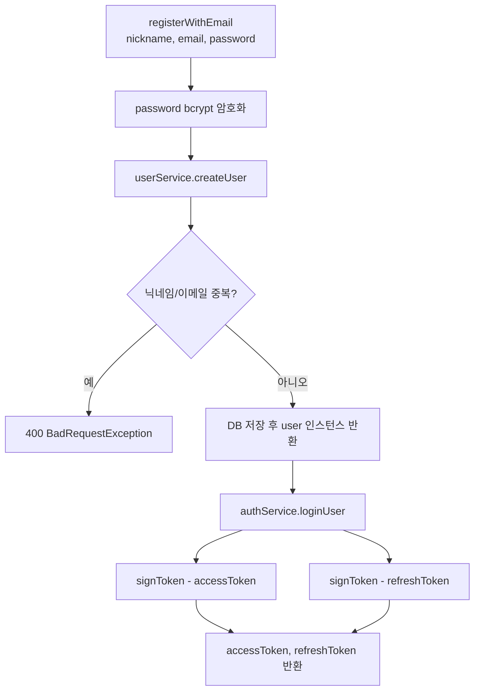
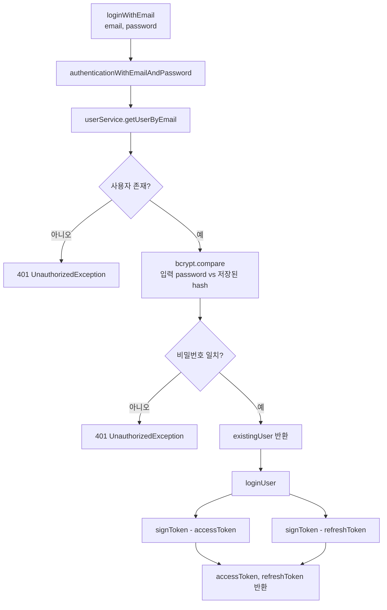
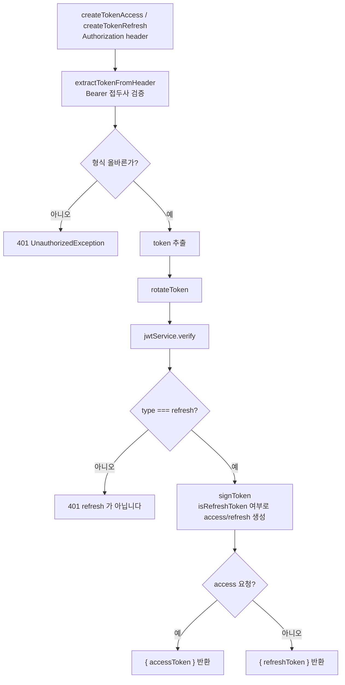

# JWT 인증

nestjs 에서 JWT 와 bcrypt 를 사용한 인증 파이프라인 구축을 다룬 내용이다.

## 본론

### 왜 bcrypt 인가?

비밀번호 저장에는 암호화(양방향)가 아니라 **해시(일방향)** 를 쓴다. 해시 알고리즘에는 `bcrypt`, `md5`, `sha1` 등 다양하게 있으나, 비밀번호용으로는 `bcrypt` 가 범용적으로 사용된다.

이유는 크게 두 가지다. **내장 salt** 와 **의도적으로 느린 연산(cost / rounds)** 이다.

여러 웹사이트에서 계정 비밀번호를 다 다르게 사용하는 사람들도 있으나, 거의 대부분은 귀찮음을 이유로 동일한 비밀번호를 사용한다. 그리고 꽤 그 비밀번호가 겹친다. 실제로 [most-common-passwords-list](https://nordpass.com/most-common-passwords-list/) 이런 사이트에서는 자주 사용되는 비밀번호 랭킹도 존재한다.

때문에 해커들은 이런 취약점을 겨냥하여 자주 사용하는 비밀번호 목록을 만들어놓고, 사용했을 법한 해시 알고리즘으로 미리 해시값을 계산해 저장해둔다. 이를 `Rainbow Table`(사전 계산 테이블) 공격이라고 한다.

salt 를 사용하면 같은 비밀번호라도 해시 결과가 달라져서, 미리 만들어 둔 레인보우 테이블을 그대로 쓸 수 없다. salt 는 그냥 문자열이다. salt = handmk 도 가능하지만 보통은 긴 난수 문자열을 사용한다.

중요한 점은 salt 가 **비밀이 아니다** 는 것이다. bcrypt 해시 문자열 안에 salt 가 함께 저장되므로, 해시를 보면 salt 도 같이 보인다. salt 의 목적은 숨기는 게 아니라 계정마다 다르게 만들어서 사전 계산을 무력화하는 것이다.

'123456' 이라는 비밀번호가 있을 때 `bcrypt` 는 비밀번호와 salt 를 섞어 해시한다. 단순히 123456 만 해시한 값과 전혀 다른 결과가 나온다. 게다가 cost(rounds) 로 해시 계산 자체를 느리게 만들기 때문에, 오프라인에서 비밀번호를 하나씩 대입하는 공격도 비용이 커진다. 이 때문에 `bcrypt` 가 비밀번호 저장에 많이 사용된다.

### 관련 패키지 설정

jwt 와 bcrypt 패키지를 설치하기 위해선 다음 명령어를 호출한다.

```shell
yarn add @nestjs/jwt bcrypt
```

또한 인증/인가를 관리하는 모듈 (ex. auth) 에서 import 해준다. 

**AuthModule**

```tsx
import { Module } from "@nestjs/common";
import { AuthService } from "./auth.service";
import { AuthController } from "./auth.controller";
import { JwtModule } from "@nestjs/jwt";
import { UsersModule } from "src/users/users.module";

@Module({
  imports: [
    JwtModule.register({}), // jwt 모듈 추가
    UsersModule
  ],
  controllers: [AuthController],
  providers: [AuthService],
})
export class AuthModule {}
```


### 회원가입 구현

회원가입 시 nickname, email, password 를 입력받아 사용자 정보를 저장하는 기능을 구현한다.

**Authcontroller**

```tsx
@Post("register/email")
  registerEmail(
    @Body("nickname") nickname: string,
    @Body("email") email: string,
    @Body("password") password: string,
  ) {
    return this.authService.registerWithEmail({ nickname, email, password });
  }
```

컨트롤러에서 정보를 입력받은 뒤 플로우는 다음과 같다.




**AuthService**

```tsx
  /**
   * 
   * @param user nickname, email, password
   */
  async registerWithEmail(
    user: Pick<Users, "nickname" | "email" | "password">,
  ) {
    const hash = await bcrypt.hash(user.password, HASH_ROUND);

    const newUser = await this.userService.createUser({
      ...user,
      password: hash,
    });

    return this.loginUser(newUser);
  }

    loginUser(user: Pick<Users, "email" | "id">) {
    return {
      accessToken: this.signToken(user, false),
      refreshToken: this.signToken(user, true),
    };
  }

    /**
   * Payload 들어갈 정보
   * (1) email
   * (2) sub -> id
   * (3) type: 'access' | 'refresh'
   */
  signToken(user: Pick<Users, "email" | "id">, isRefreshToken: boolean) {
    const payload = {
      email: user.email,
      sub: user.id,
      type: isRefreshToken ? "refresh" : "access",
    };

    return this.jwtService.sign(payload, {
      secret: JWT_SECRET, // salt
      expiresIn: isRefreshToken ? 3600 : 300, // sec
    });
  }
```

**UserService**

```tsx
  /**
   * nickname, email, password 를 입력받아 사용자 정보를 저장하는 함수이다.
   * @param user nickname, email, password
   * @returns userObject
   * @throws BadRequestException 닉네임 중복 시
   * @throws BadRequestException 중복 이메일 시
   * @throws Error 사용자 정보 저장 실패 시
   */
  async createUser(user: Pick<Users, "nickname" | "email" | "password">) {
    const nicknameExists = await this.userRepository.exists({
      where: {
        nickname: user.nickname,
      },
    });

    if (nicknameExists) {
      throw new BadRequestException("닉네임 중복!");
    }

    const emailExist = await this.userRepository.exists({
      where: {
        email: user.email,
      },
    });

    if (emailExist) {
      throw new BadRequestException("중복 이메일!");
    }

    const userObject = await this.userRepository.save({
      nickname: user.nickname,
      email: user.email,
      password: user.password,
    });

    return userObject;
  }
```


### 로그인 구현

email, password 를 입력받아 사용자를 인증하고 access/refresh 토큰을 발급한다.

**AuthController**

```tsx
@Post("login/email")
loginEmail(@Body("email") email: string, @Body("password") password: string) {
  return this.authService.loginWithEmail({ email, password });
}
```




**AuthService**

```tsx
async loginWithEmail(user: Pick<Users, "email" | "password">) {
  const existingUser = await this.authenticationWithEmailAndPassword(user);
  return this.loginUser(existingUser);
}

async authenticationWithEmailAndPassword(
  user: Pick<Users, "email" | "password">,
) {
  const existingUser = await this.userService.getUserByEmail(user.email);

  if (!existingUser) {
    throw new UnauthorizedException("존재하지 않는 사용자입니다.");
  }

  const passOk = await bcrypt.compare(user.password, existingUser.password);

  if (!passOk) {
    throw new UnauthorizedException("비밀번호가 일치하지 않습니다.");
  }

  return existingUser;
}
```


### 토큰 재발급 구현

access / refresh 토큰이 만료되면 refresh 토큰으로 새 토큰을 발급한다.
둘 다 `Authorization: Bearer {refreshToken}` 헤더가 필요하고, 내부적으로는 `rotateToken` 을 공유한다.


| 엔드포인트                 | 메서드                  | 결과                 |
| --------------------- | -------------------- | ------------------ |
| `/auth/token/access`  | `createTokenAccess`  | `{ accessToken }`  |
| `/auth/token/refresh` | `createTokenRefresh` | `{ refreshToken }` |


**AuthController**

```tsx
@Post("token/access")
createTokenAccess(@Headers("authorization") rawToken: string) {
  const token = this.authService.extractTokenFromHeader(rawToken, true);
  const newToken = this.authService.rotateToken(token, false);
  return { accessToken: newToken };
}

@Post("token/refresh")
createTokenRefresh(@Headers("authorization") rawToken: string) {
  const token = this.authService.extractTokenFromHeader(rawToken, true);
  const newToken = this.authService.rotateToken(token, true);
  return { refreshToken: newToken };
}
```




**AuthService**

```tsx
extractTokenFromHeader(header: string, isBearer: boolean) {
  const splitToken = header.split(" ");
  const prefix = isBearer ? "Bearer" : "Basic";

  if (splitToken.length !== 2 || splitToken[0] !== prefix) {
    throw new UnauthorizedException("잘못된 토근 입니다!");
  }

  return splitToken[1];
}

rotateToken(token: string, isRefreshToken: boolean) {
  const decoded = this.jwtService.verify(token, {
    secret: JWT_SECRET,
  });

  if (decoded.type !== "refresh") {
    throw new UnauthorizedException("refresh 가 아닙니다!");
  }

  return this.signToken(
    {
      email: decoded.email,
      id: decoded.sub,
    },
    isRefreshToken,
  );
}
```

> **주의:** decode 된 JWT payload 는 `sub` 필드를 쓰고, `signToken` 은 `user.id` 를 읽는다.
> 그래서 `signToken({ ...decoded })` 로 넘기면 `id` 가 `undefined` 가 된다.
> 위처럼 `id: decoded.sub` 로 매핑해서 넘겨야 한다.


### JWT Payload 정리


| 필드      | 의미                       |
| ------- | ------------------------ |
| `email` | 사용자 이메일                  |
| `sub`   | 사용자 id                   |
| `type`  | `'access'` | `'refresh'` |


| 토큰      | 만료 시간       |
| ------- | ----------- |
| access  | 300초 (5분)   |
| refresh | 3600초 (1시간) |


회원가입/로그인 성공 시 둘 다 발급되고, 이후 access 만료 시 refresh 로 `/auth/token/access` 를 호출해 재발급한다.