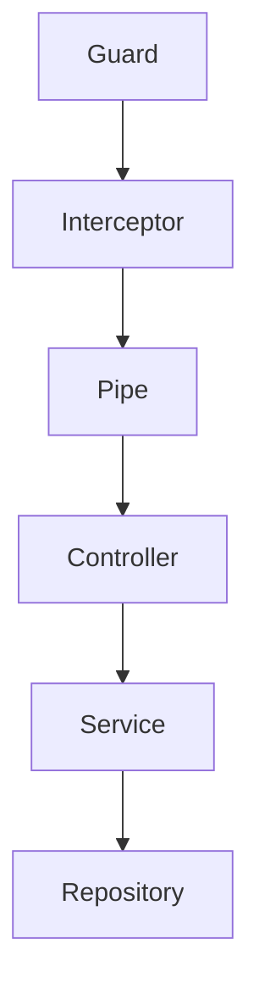

# Pipe 

nestjs 에서 Pipe 전 Gaurd 에 대한 내용이다.

## 본론

### gaurd?
Guard는 요청을 보호하며, Pipe 실행 전에 실행되어 요청의 처리 계속 여부를 결정한다.



### 커스텀 pipe 구성

[공식제공](https://docs.nestjs.com/pipes#built-in-pipes) 하는 pipe 가 있긴하나, 보통은 커스텀해서 사용한다.

이때 커스텀 클래스에 `@Injectable()` 데코레이터를 붙여야 하며,`PipeTransform` 인터페이스를 구현해야 한다.

**password.pipe.ts**

``` tsx
@Injectable()
export class PasswordPipe implements PipeTransform {
    transform(
        value: any,
        metadata: ArgumentMetadata // 파라미터 메타데이터
    ) {
        if (value.toString().length > 8) {
            throw new BadRequestException('비밀번호는 8자 이하여야 합니다.');
        }

        return value.toString();
    }
}

@Injectable()
export class MaxLengthPipe implements PipeTransform {

    constructor(private readonly length: number){}
    transform(value: any, metadata: ArgumentMetadata){
        if (value.toString().length > this.length){
            throw new BadRequestException(`${length}자 이하여야 합니다.`);
        }
        return value.toString();
    }
}

@Injectable()
export class MinLengthPipe implements PipeTransform {
    constructor(private readonly length: number){}
    transform(value: any, metadata: ArgumentMetadata){
        if (value.toString().length < this.length){
            throw new BadRequestException(`${length}자 초과여야 합니다.`);
        }
        return value.toString();
    }
}
```

그리고 컨트롤러의 parameter 나 body 에 다음과 같이 붙여 사용한다.

``` tsx
  @Post("register/email")
  @ApiOperation({ summary: "이메일 회원가입" })
  @ApiBody({ schema: { type: "object", properties: { nickname: { type: "string" }, email: { type: "string" }, password: { type: "string" } } } })
  registerEmail(
    @Body("nickname") nickname: string,
    @Body("email") email: string,
    @Body("password", new MinLengthPipe(8), new MinLengthPipe(3)) password: string,
  ) {
    return this.authService.registerWithEmail({ nickname, email, password });
  }
```