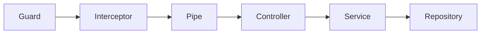
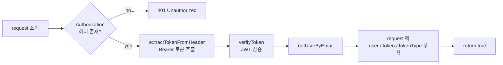

# Guard

nestjs 에서 Pipe 전에 실행되어 요청 처리 계속 여부를 결정하는 Guard 에 대한 내용이다.

## 본론

### guard?

Guard 는 요청을 보호한다. Pipe 보다 먼저 실행되며, `canActivate` 반환값이 `true` 면 다음 단계로 넘어가고 `false` 이거나 Exception 을 던지면 요청이 차단된다.

Nest 요청 파이프라인에서의 위치는 다음과 같다.



커스텀 Guard 는 `@Injectable()` 을 붙이고 `CanActivate` 인터페이스를 구현한다.
핵심 메서드는 `canActivate(context: ExecutionContext)` 이다.

`ExecutionContext` 로 현재 요청 객체를 꺼낼 수 있다.

```tsx
const request = context.switchToHttp().getRequest();
```

### JwtTokenGuard 구현

JWT 를 검증하고, 검증된 사용자 정보를 request 에 붙여주는 Guard 를 구현한다.

파일 상단 주석은 Basic 인증 플로우를 적어둔 흔적이고, 실제 구현은 Bearer JWT 검증이다.

**jwt-token.guard.ts**

```tsx
@Injectable()
export class JwtTokenGuard implements CanActivate {
  constructor(
    private readonly authService: AuthService,
    private readonly userService: UsersService,
  ) {}

  // false 이거나 Exception 이면 Guard 통과 X
  async canActivate(context: ExecutionContext): Promise<boolean> {
    const request = context.switchToHttp().getRequest();

    const rawToken = request.headers["authorization"];

    if (!rawToken) {
      throw new UnauthorizedException("Authorization 헤더가 없습니다!");
    }

    const token = this.authService.extractTokenFromHeader(rawToken, true);
    const result = this.authService.verifyToken(token);

    const user = await this.userService.getUserByEmail(result.email);

    request.user = user;
    request.token = token;
    request.tokenType = result.type;

    return true;
  }
}
```

플로우는 다음과 같다.



정리하면 Guard 가 하는 일은 세 가지다.

1. 헤더에서 Bearer 토큰 추출
2. JWT 검증 후 payload 의 email 로 사용자 조회
3. 이후 Controller / Service 에서 쓰도록 `request` 에 정보 부착

### AccessTokenGuard

`JwtTokenGuard` 를 상속해서, 토큰 type 이 `access` 인 경우만 통과시키는 Guard 다.

```tsx
@Injectable()
export class AccessTokenGuard extends JwtTokenGuard {
  async canActivate(context: ExecutionContext): Promise<boolean> {
    await super.canActivate(context);

    const request = context.switchToHttp().getRequest();
    if (request.tokenType !== "access") {
      throw new UnauthorizedException("Access Token 이 아닙니다!");
    }

    return true;
  }
}
```

- `super.canActivate()` 로 공통 JWT 검증 + request 부착을 먼저 수행
- 그 다음 `request.tokenType` 이 `access` 인지 추가 검사
- refresh 토큰으로 access 전용 API 를 호출하는 경우를 막는다

### 컨트롤러에서 사용

`@UseGuards()` 로 엔드포인트에 붙인다.

```tsx
@Post("token/access")
@UseGuards(JwtTokenGuard)
createTokenAccess(@Headers("authorization") rawToken: string) {
  const token = this.authService.extractTokenFromHeader(rawToken, true);
  const newToken = this.authService.rotateToken(token, false);

  return {
    accessToken: newToken,
  };
}
```

지금은 `createTokenAccess` 에 `JwtTokenGuard` 를 붙인 상태다.
access 토큰만 받고 싶다면 `AccessTokenGuard` 로 바꾸면 된다.

> 참고: Guard 안에서 이미 토큰을 검증하고 `request` 에 붙여두므로,
> 컨트롤러에서 `extractTokenFromHeader` 를 다시 호출하는 건 중복이다.
> 이후에는 `@Req() req` 로 `req.token` / `req.user` 를 쓰는 방식으로 정리할 수 있다.
